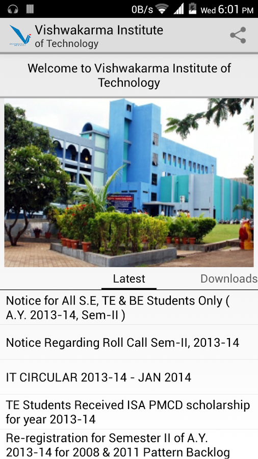
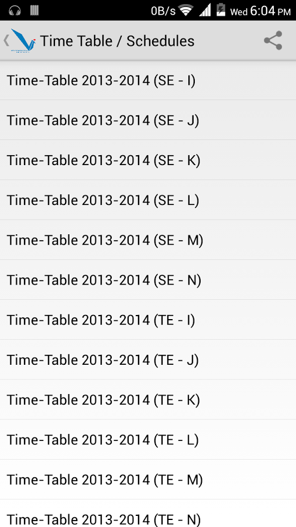
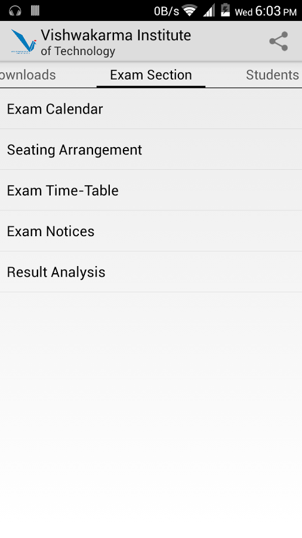

# Android app for Vishwakarma Institute of Technology

## Build Steps:
* Clone the repository to your local 
  `git clone https://github.com/rahul-pande/vit.git`
* Import the project into Android Studio. The code base is based on Eclipse with ADT plugin. Android studio will migrate it for you with gradle build system
* Build the app and sign the apk and install. You can use the default build keys to sign for a debug-build

## Important Note:
The app no longer works since it is dependent on the website and the website has changed a lot over the years. However, making it to work should be fairly easy.

## Screenshots

  
